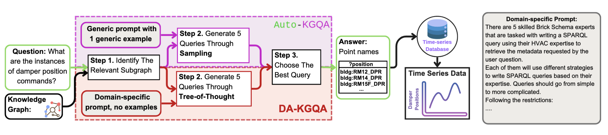

# DA-KGQA

**DA-KGQA** (Domain Adapted KGQA) is a domain-aware, zero-shot framework for text-to-SPARQL, based on Large Language Models (LLMs) designed and tested on Brick schema to analyze the potential of LLM-powered KGQA for CPS-IoT. It extends the Auto-KGQA pipeline with structured prompting and multi-agent query generation strategies, resulting in improved robustness and cost-efficiency across a range of model sizes and question complexities.

Given a Knowledge Graph **K** and a natural language question **Q**, DA-KGQA selects relevant T-Box and A-Box fragments from **K**, then prompts the LLM to simulate multiple expert agents. Each agent independently generates a candidate SPARQL query using diverse strategies and reasoning depths. These queries are ranked by their execution results on **K**, and the best one is selected. Finally, DA-KGQA produces a natural language answer based on the user’s question, the selected query **S**, and the query results over **K**.

Unlike traditional KGQA systems, DA-KGQA retrieves *point names*—identifiers of relevant timeseries data—not the data itself. This design aligns with systems like Energon and Mortar, enabling integration with external BAS or analytics engines.

## Key Features
- Tree-of-thought prompting with simulated expert agents
- Fully zero-shot with no finetuning or examples
- Selective KG fragmenting to reduce hallucinations
- Outperforms Auto-KGQA on complex queries and with smaller LLMs for KGs created using Brick schema.
- Cost-efficient: up to 48% reduction with small models

## Framework Architecture


## Getting Started

1. Download GraphDB and upload vm3a.ttl as our KG.
3. Create a `.env` file inside the `[API/](API/)` directory with your OpenAI key:
   > OPENAI_API_KEY = OPENAI_TOKEN
3. Configure the file "[API/configs.py](API/configs.py)" with the URIs of the SPARQL endpoints (can be extracted from GraphDB) to be queried and the file name for query persistence and feedback.
4. Run the teste.py script in "[API/](API/)" directory:
   > python teste.py

## Citation
If you use DA-KGQA in your research, please cite:

```bibtex
@misc{baris2025dakgqa,
  title={Towards Zero-shot Question Answering in CPS-IoT: Large Language Models and Knowledge Graphs},
  author={Ozan Baris and Gabe Fierro and Mario Bergés and Marco Pritoni},
  year={2025},
  note={The 2nd International Workshop on Foundation Models for Cyber-Physical Systems \& Internet of Things (FMSys'25)}
}
